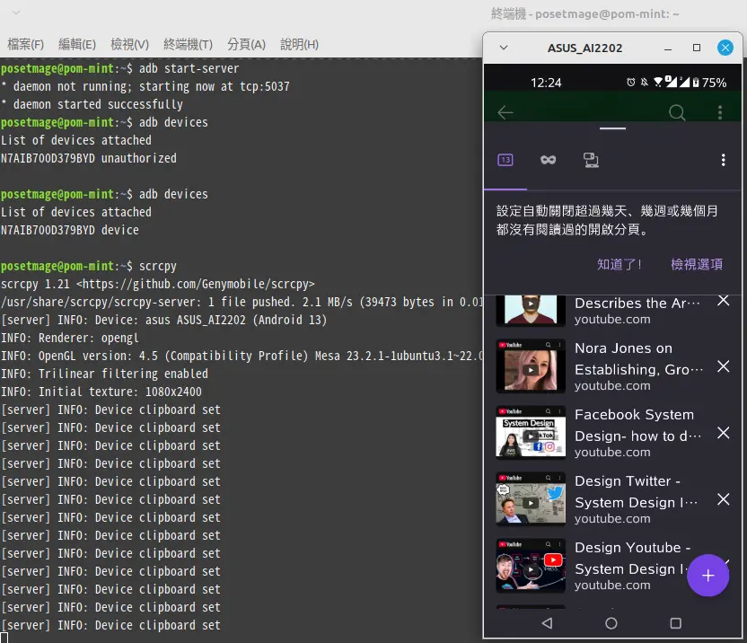

# Operate Android Mirror Projection

Using `scrcpy` is one of the best ways to mirror and control your Android phone on Linux/Windows. This guide will walk you through the steps to set up and troubleshoot `scrcpy` to get your phone connected and working perfectly.

---

## **Enable USB Debugging**

1. On your Android phone, go to **Settings** > **About phone**.
2. Tap **Build number** 7 times to enable Developer Options.
3. Go back to **Settings** > **System** > **Developer options**.
4. Find and enable **USB debugging**.
5. Try connect ```adb``` or ```scrcpy```
6. press Authentication on phone
7. connect again

---

## On Windows

Remember **Enable USB Debugging** first.

Just download from [Download — SCRCPY (Screen Copy)](https://scrcpy.org/download/)

and unzip -> Enable USB Debugging -> run ```scrcpy.exe```

## On Linux

Remember **Enable USB Debugging** first.

---

## **Step 1: Install scrcpy**

First, install `scrcpy` on your Linux system. It’s available in most distributions’ package managers.

Ubuntu or Debian-based distributions:
```bash
sudo apt install scrcpy
```

Arch-based distributions:
```bash
sudo pacman -S scrcpy
```

For other distributions, refer to the official [scrcpy GitHub page](https://github.com/Genymobile/scrcpy) for installation instructions.

---

## **Step 2: Run scrcpy**

Add user to ```plugdev``` group
```
sudo usermod -aG plugdev $USER
```
After enabling USB debugging, connect your phone to your Linux system with a USB cable. Then, try running:

```bash
scrcpy
```

If everything is set up correctly, you should see your phone screen appear on your desktop. However, if `scrcpy` fails, you may encounter an error like this:

```plaintext
scrcpy 1.21 <https://github.com/Genymobile/scrcpy>
* daemon not running; starting now at tcp:5037
* daemon started successfully
error: insufficient permissions for device: user in plugdev group; are your udev rules wrong?
See [http://developer.android.com/tools/device.html] for more information
ERROR: "adb get-serialno" returned with value 1
ERROR: Could not get device serial
ERROR: Server connection failed
```

This indicates a permissions issue with your device. The next steps will walk you through debugging and fixing this issue.

---

## **Step 3: Test ADB Connection**

Start by testing the ADB connection to identify the issue. Run:

```bash
adb devices
```

You might see an error like this:

```plaintext
List of devices attached
N7AIB700D379BYD    no permissions (user in plugdev group; are your udev rules wrong?)
```

This error confirms the problem is related to insufficient permissions for your device.

---

## **Step 4: Identify Your Device**

To fix the permissions, you need to identify your device using:

```bash
lsusb
```

Example output:
```plaintext
Bus 001 Device 004: ID 0b05:7770 ASUSTek Computer, Inc. Zenfone 9
```

Here, `ID 0b05:7770` shows the `idVendor` (`0b05`) and `idProduct` (`7770`) values for your device. You’ll use these values to create a custom udev rule.

---

## **Step 5: Add Udev Rules**

Udev rules help Linux manage USB device permissions. Follow these steps:

1. Create a new udev rules file:
   ```bash
   sudo nano /etc/udev/rules.d/51-android.rules
   ```

2. Add the following rule for your device. Adjust it based on the `idVendor` and `idProduct` values you found with `lsusb`:
   ```plaintext
   SUBSYSTEM=="usb", ATTR{idVendor}=="0b05", ATTR{idProduct}=="7770", MODE="0666", GROUP="plugdev"
   ```

   This example is for an ASUS Zenfone 9. Replace `0b05` and `7770` with the values specific to your phone.

3. Save the file and apply the correct permissions:
   ```bash
   sudo chmod a+r /etc/udev/rules.d/51-android.rules
   ```

4. Reload the udev rules:
   ```bash
   sudo udevadm control --reload-rules
   sudo udevadm trigger
   ```

---

## **Step 6: Authorize USB Debugging**

1. Disconnect and reconnect your phone.
2. Run:
   ```bash
   adb devices
   ```

   If your device shows up as `unauthorized`, check your phone's screen for a prompt to allow USB debugging. Select **Allow** and, optionally, check **Always allow from this computer**.

3. Run `adb devices` again. You should now see:
   ```plaintext
   List of devices attached
   N7AIB700D379BYD    device
   ```

---

## **Step 7: Start scrcpy**

With your device recognized and authorized, you can now successfully start `scrcpy`:

```bash
scrcpy
```

Your Android screen should appear on your Linux desktop, and you can control your phone directly from your computer.

