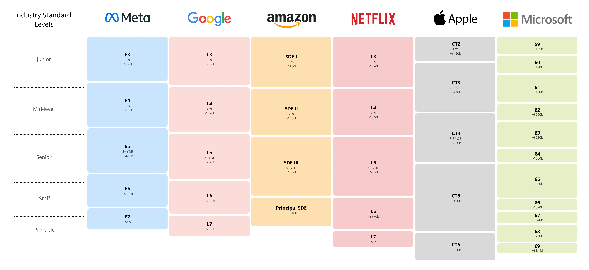

# System Design Interview

## Introduction

During the early 2000s to mid-2010s, unconventional interview questions became a hallmark of not only tech companies like Google but also universities aiming to identify top talent. Questions such as the famous "Google Intern Movie" blender question or the "How many ping-pong balls can fit in a plane?" were not intended to test specific technical skills. Instead, they focused on evaluating problem-solving abilities, creativity, logical reasoning, and how individuals approached open-ended challenges.

By the late 2010s, tech companies began moving away from abstract brainteasers, finding them ineffective at predicting real-world success. Instead, they adopted structured processes that are still widely used today, including:
* **take-home assignments** : to assess practical skills 
* **system design interviews** : for evaluating architectural thinking
* **behavioral questions (BQ)** : to gauge interpersonal abilities and cultural fit.

This modern approach balances technical expertise with problem-solving and teamwork skills.

Usually for L4~L6+: 

## Books

* System Design Interview – An insider's guide by Alex Xu 
  * zh:內行人才知道的系統設計面試指南
* (神書DDIA) Designing Data-Intensive Applications by Martin Kleppmann 
  * zh: 设计数据密集型应用
* (私心推薦) 大話AWS雲端架構

很多人推薦 Grokking the System Design Interview 課程作為入門，雖然這個課程偏簡單但就是最佳的入門教材了，一次又一次的帶領學生練習系統面試應該有的流程。

Alex的書是必看，由淺入深讓讀者理解系統設計是迭代改進的，避免一開始就陷入"解題思維"直接寫一大堆架構。

DDIA 是神書，能多看幾輪就多看幾輪，系統設計中最重要的 trade-off 在DDIA書中幾乎都找的到。

其他的資源 [InfoQ](https://www.youtube.com/@infoq) 能多看就多看，還有各大廠的 Blog 經常會說現在使用的架構。

## newgpu

進階資源，上面的基礎要先看完。

* [Youtube](https://www.youtube.com/@newgpu-sys-design/videos)
  * 愿景：提升北美科技公司【华人】面试和工作能力。主要针对senior+级别。
  * Discord群：https://discord.gg/SAEBsMvyVK
* 一亩三分地
  * [深度谈谈系统设计面试](https://www.1point3acres.com/bbs/thread-1061024-1-1.html)
  * [ [找工就业]L6和L5系统设计面试区别 ](https://www.1point3acres.com/bbs/thread-1054990-1-1.html)
  * [ [跳槽]L6和L5面试区别(BQ&系统设计) ](https://www.1point3acres.com/bbs/thread-1055577-1-1.html)
  * [ [找工就业]跳槽拿了7个senioroffer分享一下经验 ](https://www.1point3acres.com/bbs/thread-768263-1-1.html)

## Youtube 

* Search "Mock System Design Interview"
* Search "System Design Interview"
* [Scott Shi](https://www.youtube.com/@ScottShiCS/videos)
* [System Design Interview](https://www.youtube.com/@SystemDesignInterview/videos)

## Github
* [System Design Primer](https://github.com/donnemartin/system-design-primer)
* [Grokking the System Design Interview](https://github.com/sharanyaa/grok_sdi_educative)
  * grok的文字版，不想花錢上課的話
* [rmlzy收集的电子书](https://github.com/rmlzy/my-ebook)
  * 看到別人蒐集的書，內有DDIA中文版

## 一亩三分地

很多海外的華人都會發文在一亩三分地

* [标签：系统设计](https://www.1point3acres.com/bbs/tag-20-1.html)
* [ [经验总结]从面试官+realworld角度谈如何搞定系统设计(别被某些热门教程误导了) ](https://www.1point3acres.com/bbs/thread-1086103-1-1.html)
* [每个公司的系统设计轮侧重](https://www.1point3acres.com/bbs/forum.php?mod=redirect&goto=findpost&ptid=581118&pid=9601655)
* [ [经验总结]1000+刷题经验及面试感悟分享之系统设计总结 ](https://www.1point3acres.com/bbs/thread-771667-1-1.html)
* [ [找工就业][找工面试指南][系统设计]FLAG面试官谈系统设计 ](https://www.1point3acres.com/bbs/thread-763014-1-1.html)
* [FB近期系统设计题总结及对策](https://www.1point3acres.com/bbs/thread-680958-1-1.html)
* [ [经验总结]一篇文章解决所有systemdesign面试 ](https://www.1point3acres.com/bbs/thread-559285-1-1.html)

## Others
* [架构精进之路](https://my.oschina.net/jiagoujingjin)
* [System Design Sharing - Google Drive](https://drive.google.com/drive/u/0/folders/1XtU3k1jyl8l47FJ6ScllqcTQaQMOec5z)
  * 忘記從哪拔到的連結 =.= 如果有人知道源頭跟我說
* [nullwy's blog](https://nullwy.me/categories/%E6%9E%B6%E6%9E%84/)