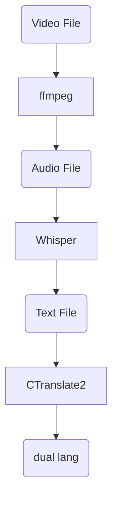

# Subtitle 

Subtitle with dual-lang

## Methods:
* [Translate](./Translate.md)
* [Whisper](./Whisper.md)

##
Real-example:
https://www.youtube.com/watch?v=XhEk5MEVfcw

## Flow:

```mermaid
graph TD;
    Video(Video File)--> ffmpeg;
    ffmpeg --> Audio(Audio File);
    Audio --> Whisper;
    Whisper --> srt(Text File);
    srt --> CTranslate2;
    CTranslate2 --> dual(dual lang);

```